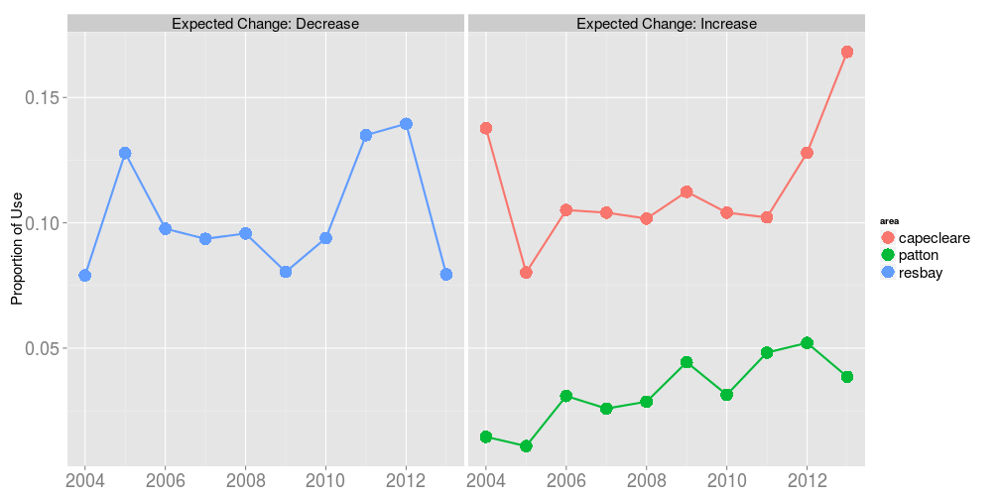
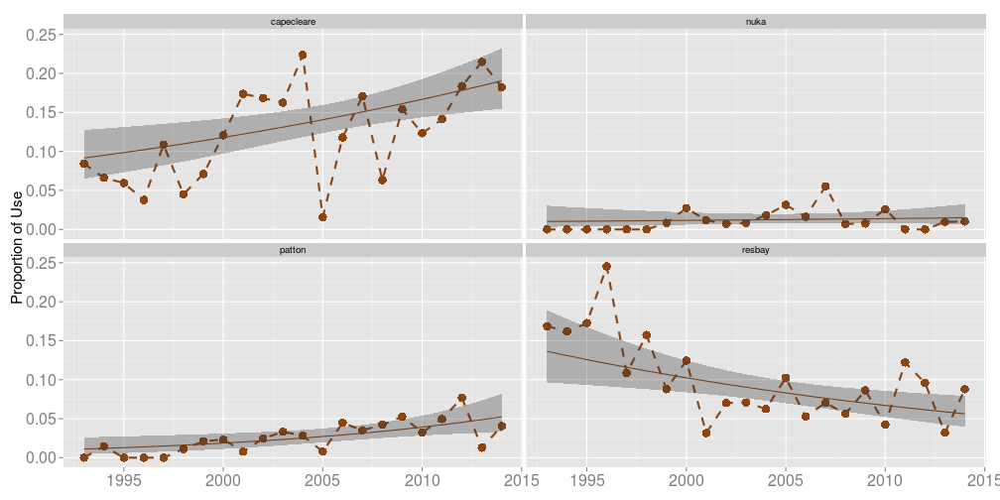
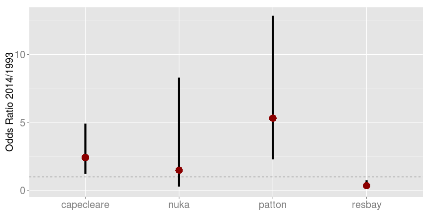
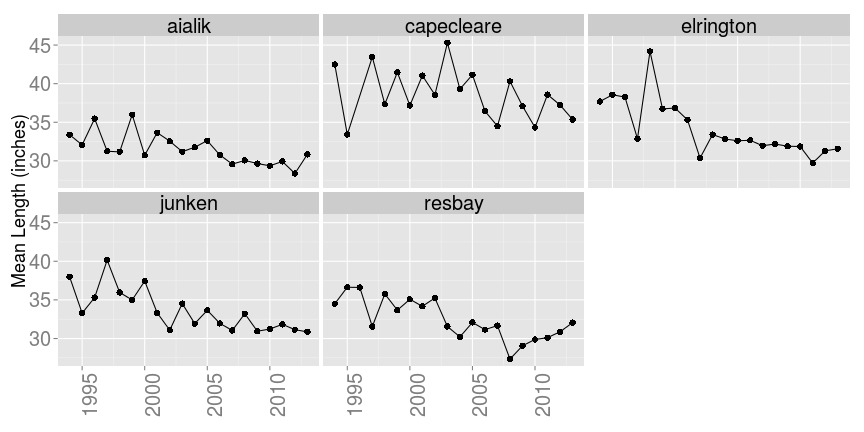
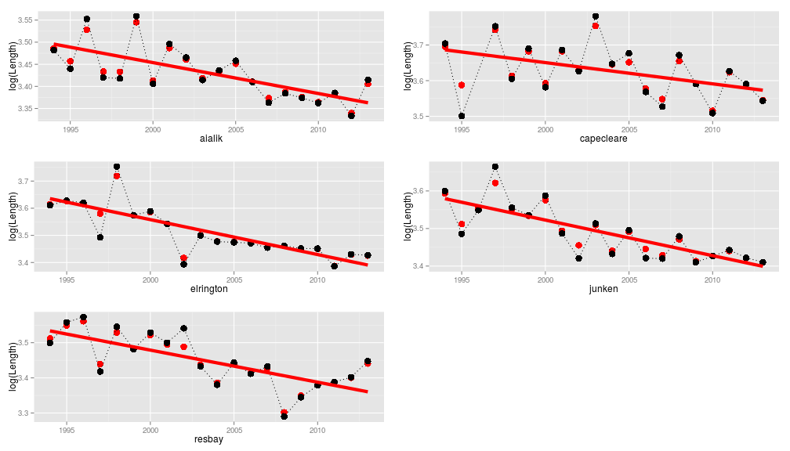
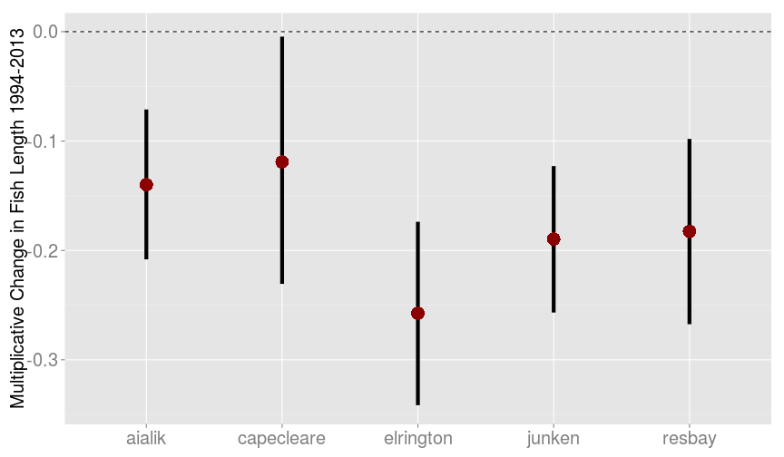
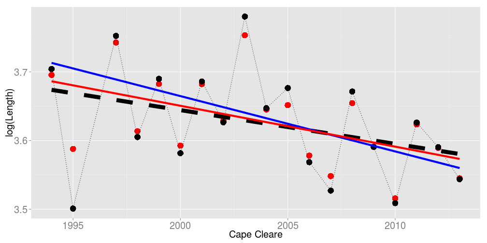
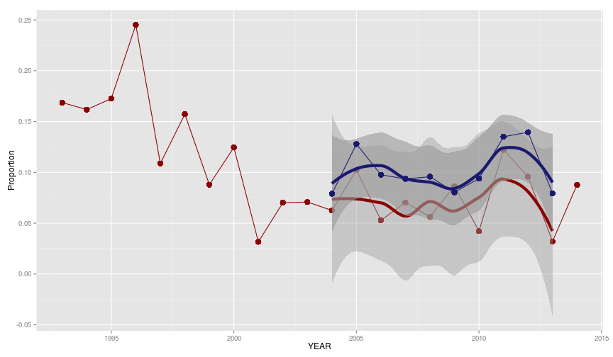
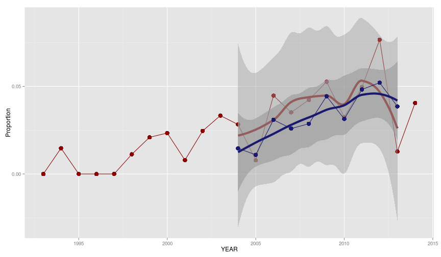
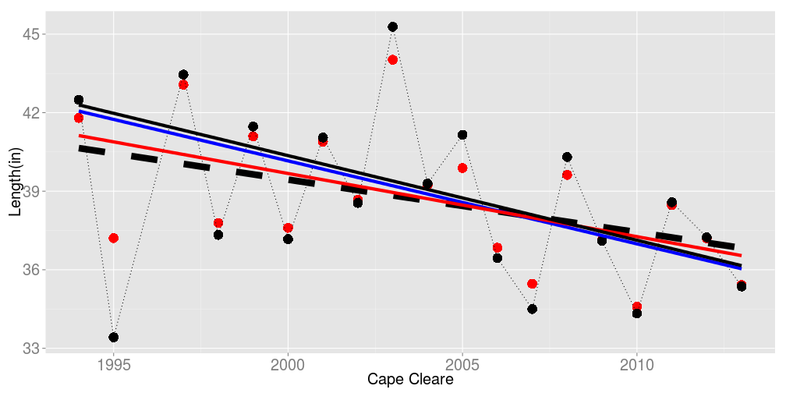

--- .class1 #id1 bg:darkcyan

       

<link href='http://fonts.googleapis.com/css?family=Amatic+SC:700' rel='stylesheet' type='text/css'>

"We travel farther for smaller fish" 
 

--- .class1 #id1 bg:grey
## Questions of Interest

Data from Alaska Department of Fish and Game

 **Question 1**: Is there evidence that the distance Seward charter boats travel to fish for bottomfish has changed over the years 1993-2014?  

Logbook Data  
 
Interview Data 

  
 **Question 2**: Is there evidence of a change in the mean length of halibut caught by Seward fishermen over the years 1994-2013? 
 

Biological Data

--- &vcenter
## Data Reference

<ol>
<li>
ADF&G Saltwater Logbook Database. 2004-2013. Anchorage, AK: Alaska Department of Fish and Game, Divison of Sport Fish. Intranet. Accessed 15 Dec 2014. Custom query details available upon request from ADF\&G, Division of Sport Fish, Research and Technical Services. </li>
 
<li>
ADF&G non-confidential data. 1993-2014. Homer, AK: Alaska Department of Fish and Game, Division of Sport Fish. Personal communication, Scott Meyer.</li>
 
<li>
ADF&G non-confidential data. 1994-2013. Homer, AK: Alaska Department of Fish and Game, Division of Sport Fish. Personal communication, Scott Meyer.</li>
</ol>

---
## Logbook Data 2004-2013

---

---

<!------>

---

---
## Logbook: 2004-2013

 

---
## Interview Data 1993-2014

<ul style="list-style-type:circle">
<li>Two days a week randomly selected for interviews </li>
<li>Effort spread across the four harbor cleaning stations </li>
<li>Each boat is asked:</li>

<ul style="list-style-type:persian">
<li>Did you catch bottom fish today?</li>

<li>If yes, record trip type</li>

<li>Identify the primary statistical area where the majority of bottomfish were caught.</li>
</ul>
</ul>

 

|abbreviation |description                                                                     |
|:------------|:-------------------------------------------------------------------------------|
|H            |halibut exclusively                                                             |
|B            |any combination of bottomfish (halibut, rockfish, lingcod, Pacific cod, sharks) |
|B+S          |any combination of bottomfish and salmon (e.g. halibut+coho)                    |

---
## Interview 1993-2014

 

---
## Comparison- Cape Cleare

 

---

## Fitted Probabilities and 95% Pointwise CIs

 

---

The odds of fishing in Cape Cleare in $2014$ are estimated to be $2.43$ times the odds of fishing in Cape Cleare in $1993$, with a $95\%$ confidence interval from $1.22$ to $4.92$ times. 

The odds of NOT fishing in Resurrection Bay in $2014$ are estimated to be $2.78$ times the odds of NOT fishing in Resurrection Bay in $1993$, with a $95\%$ confidence interval from $1.32$ to $5.82$ times.

 

---
### **Question 2**: Is there evidence of a change in the mean length of halibut caught by Seward fishermen over the years 1994-2013?</li>

 

---
## Biological Data 1993-2013

 
<ul>
<li> Three days a week randomly selected for biological sampling </li>
<li> Boats selected (non-random) and entire catch is studied </li>
</ul>

  

|port   |sector  |    date| age| length|sex | statarea| length.in|area       |
|:------|:-------|-------:|---:|------:|:---|--------:|---------:|:----------|
|Seward |Charter | 5261994|  11|  120.0|F   |   495938|     47.24|resbay     |
|Seward |Charter | 5261994|  NA|  128.0|F   |   475934|     50.39|capecleare |
|Seward |Charter | 5261994|  13|   85.0|M   |   475934|     33.46|capecleare |
|Seward |Charter | 5261994|  13|   85.5|M   |   475934|     33.66|capecleare |
|Seward |Charter | 5271994|  11|  126.5|F   |   485935|     49.80|junken     |
|Seward |Charter | 5271994|  11|   95.8|F   |   475934|     37.72|capecleare |

---

---
## Average fish lengths plotted over time

 

 

--- 
In the waters around Cape Junken, there is strong evidence of a relationship between mean halibut length, on the log scale, and time over the years $1994$ to $2013$ (two-sided p-value$<0.0001$ from t-stat$=-5.520$ on $18$ df).

 

---

The median halibut length in Cape Junken is estimated to have decreased by $16.5$% over the years $1994$ to $2013$, with a $95$% confidence interval from a $11.0$% to a $21.6$% decrease. ($36$ to $30$ inches $\rightarrow$ $20.8$ to $11.5$ pounds)

 

---

95% CI for percentage change in median fish length 1994-2013 in Cape Cleare   
OLS-black dashed line (-20.4%, 3.76%)  

WLS-blue line (-22.4%, -5.34%)   

Mixed Effects-red line (-19.7%, -0.43%)

 

---
## Scope of Inference

    

Technically does not extend to all Seward boats/fish, 
BUT....

 
 
   

No causal

---.class1 #id1 bg:#CBE7A5
 
 
   

**Questions?**

--- 
## Comparison - Resurrection Bay

 

---
## Comparison - Patton Bay

 

--- 
## Quasibinomial Logistic Regression

 
 

<!--
$logit(p_{i})=\beta_0+\beta_1year_i$
-->

<!--
$i \in (1993, 1994,..., 2014)$
-->

<ul style="list-style-type: circle; width:686px; margin:auto">

<li>Each area modeled separately</li>

<li>Assumptions</li>
<ul style="list-style-type:persian">
<li> Independence </li>
<li> Linearity </li>
<li> Outliers </li>
</ul> </ul>

--- .dontcount
## Results

There is moderate evidence that the log odds of fishing at Cape Cleare changes over time, assuming a linear trend over years $1993$ to $2014$ (p-value$=0.02479$ from drop-in-deviance F-stat$=5.89$). 

 

|           | YEAR coef|     SE| F-stat| Pr(>F)|
|:----------|---------:|------:|------:|------:|
|capecleare |    0.0404| 0.0161|  5.891| 0.0248|
|resbay     |   -0.0463| 0.0171|  7.351| 0.0134|
|nuka       |    0.0188| 0.0385|  0.238| 0.6309|
|patton     |    0.0760| 0.0200| 12.532| 0.0021|

--- .dontcount
## Mixed Effects Model
Each area modeled separately

 
 

$length_{i}=\beta_0+\beta_1year_i+\alpha_{i}+\epsilon_{i}$

$\epsilon_{i} \overset{iid}{\sim} N(0, \sigma^2)$

$\alpha_{i} \overset{iid}{\sim} N(0, \sigma^2_{\alpha})$

 

$i \in (1994, 1995,...,2013)$

---

 
